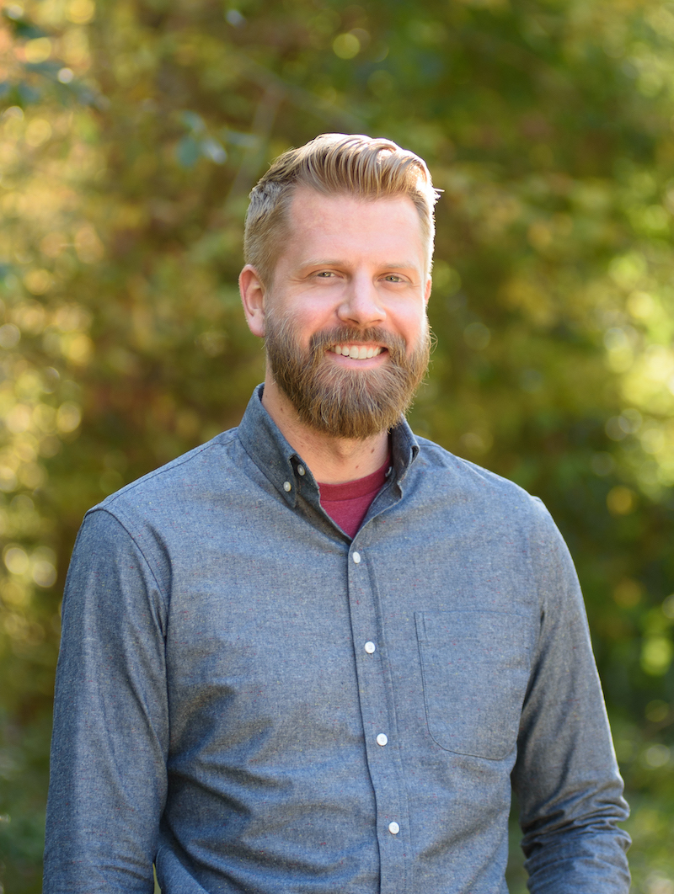

Hullo! :wave:

I'm a Senior Engineering Manager at [Polycam](https://poly.cam) where I manage the Polykit team which is responsible for our 3D rendering, geometric algorithms, and core C++ library.

I am a seasoned software developer with a diverse background in computer graphics, scientific visualization, and medical imaging. I have worked on a wide variety of technologies ranging from reverse engineering, digital inspection, 3D printing, digital dentistry and orthodontics, ultrasound, MR and CT imaging, point cloud reconstruction, rendering, and much more.

I was previously a Technical Leader on the Medical Computing Team at [Kitware](https://kitware.com) where I focused on creating, guiding, and growing medical imaging software applications built on open source technology. At Kitware, I was the resident expert on delivering software through the FDA 510(k) medical device certification process.

I have shipped both commercial and open source applications on all platforms. I will happily work in _most_ languages within any stack.
